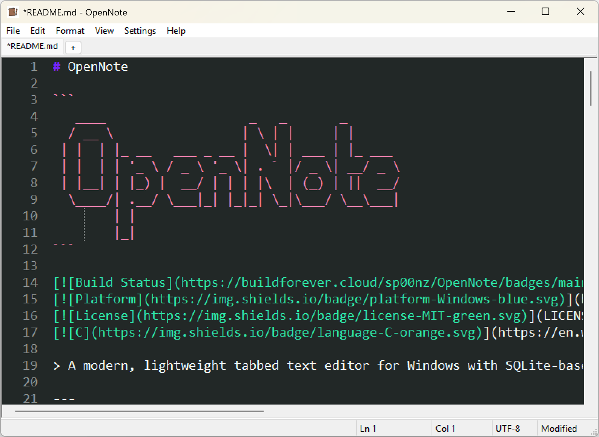

# OpenNote

```
   ____                   _   _       _
  / __ \                 | \ | |     | |
 | |  | |_ __   ___ _ __ |  \| | ___ | |_ ___
 | |  | | '_ \ / _ \ '_ \| . ` |/ _ \| __/ _ \
 | |__| | |_) |  __/ | | | |\  | (_) | ||  __/
  \____/| .__/ \___|_| |_|_| \_|\___/ \__\___|
        | |
        |_|
```

[](https://buildforever.cloud/sp00nz/OpenNote/-/pipelines)
[](https://github.com/sp00nznet/OpenNote)
[](LICENSE)
[](https://en.wikipedia.org/wiki/C_(programming_language))

> A modern, lightweight tabbed text editor for Windows with SQLite-based note storage. Built as a Notepad replacement with enhanced features for power users.

## Download

**[Download Latest Release](https://sp00.nz/releases/OpenNote/)**

---

## Screenshots

| Main Editor | Notes Browser |
|-------------|---------------|
|  |  |

---

## Features

| Feature | Description |
|---------|-------------|
| **Tabbed Interface** | Work with multiple documents simultaneously |
| **Syntax Highlighting** | Language-aware highlighting for 100+ languages |
| **SQLite Notes** | Store notes in a local database with full-text search |
| **Cloud Sync** | Sync notes with GitHub or Google Drive |
| **Session Restore** | Auto-save and restore your workspace |
| **Side-by-Side Compare** | Visual diff between any two open documents |
| **Shell Integration** | Run selected text in CMD or PowerShell (with admin) |
| **Cross-Tab Search** | Find and replace across all open tabs |

### Core Editing
- Find & Replace with match case and whole word options
- Word wrap, zoom, and customizable fonts
- Multi-level undo/redo history
- Go to line (Ctrl+G)

### Notes Database
- SQLite storage with FTS5 full-text search
- Notes browser with search and file size display
- Import files to notes, export notes to files
- Rename and organize your notes
- Cloud sync with GitHub or Google Drive

### Keyboard Shortcuts

| Shortcut | Action | Shortcut | Action |
|----------|--------|----------|--------|
| `Ctrl+N` | New file | `Ctrl+F` | Find |
| `Ctrl+O` | Open file | `Ctrl+H` | Replace |
| `Ctrl+S` | Save | `Ctrl+G` | Go To Line |
| `Ctrl+W` | Close tab | `F3` | Find Next |
| `Ctrl+Tab` | Next tab | `Ctrl++` | Zoom In |
| `Ctrl+Shift+Tab` | Previous tab | `Ctrl+-` | Zoom Out |

---

## Quick Start

```bash
# Clone the repository
git clone https://github.com/sp00nznet/OpenNote.git
cd OpenNote

# Build with CMake
cmake -B build
cmake --build build --config Release

# Run
./build/bin/OpenNote.exe
```

**Requirements:** Windows 10/11, Visual Studio 2022, CMake 3.16+

See [BUILDING.md](BUILDING.md) for detailed build instructions.

---

## Project Structure

```
OpenNote/
├── src/           # Source code
│   ├── ui/        # Window, tabs, dialogs
│   ├── core/      # Document, file I/O, search
│   ├── db/        # SQLite, notes repository
│   └── sync/      # OAuth, cloud sync
├── res/           # Resources (icons, dialogs)
├── lib/           # Third-party (SQLite, Scintilla)
├── include/       # Headers
└── docs/          # Documentation
```

See [ARCHITECTURE.md](ARCHITECTURE.md) for detailed documentation.

---

## Configuration

Settings are stored in `%APPDATA%\OpenNote\opennote.db`

- **Auto-save Session** - Save all tabs on exit
- **Default Font Size** - Set preferred editor font size
- **Theme** - Light or dark color scheme
- **Cloud Sync** - Connect GitHub or Google Drive account

---

## Contributing

Contributions welcome! Please open an issue or pull request.

1. Fork the repository
2. Create your feature branch (`git checkout -b feature/amazing`)
3. Commit your changes (`git commit -m 'Add amazing feature'`)
4. Push to the branch (`git push origin feature/amazing`)
5. Open a Pull Request

---

## License

MIT License - see [LICENSE](LICENSE) file for details.

---

<p align="center">
  Made with C and Win32 for Windows power users
</p>
